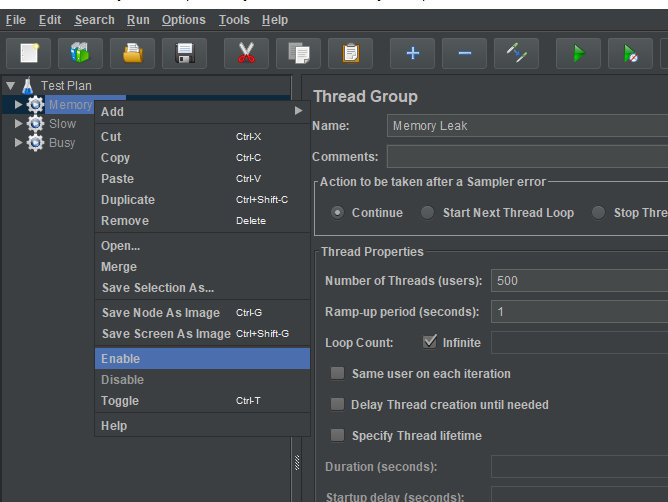

# I Code Java 2022 Demo

This project is used to illustrate resilience problems that can occur in java applications and show how you can troubleshoot them. 

* Memory Leaks
* Thread contention
* High CPU usage

## Build
You can build the project using maven `mvn clean verify` or the maven wrapper included in this repo `mvnw clean verify`

## Run the service
Run the jar using java: 
`java -Xmx256M -XX:+HeapDumpOnOutOfMemoryError -XX:+FlightRecorder -XX:StartFlightRecording=filename=flight.jfr -jar target/icj-demo-0.0.1-SNAPSHOT.jar`

## Load Tests

To run the load tests against a local instance, open the jmx file with jmeter and enable the appropriate thread group

## Replicating the Problems
### Memory Leak

* Start up the java app. Make sure `-XX:+HeapDumpOnOutOfMemoryError` is enabled
* Enable the "Memory Leak" group in the load test
* Run the load test until the jvm runs out of memory
* (Optional) Take a manual heap dump using jmap or jcmd
* Inspect the heap dump with [Eclipse Memory Analyzer](https://www.eclipse.org/mat/)

### Thread Contention

* Start up the java app.
* Enable the "Slow" group in the load test
* Run the load test for a few minutes. You should see response times in the jmeter summary view dropping.
* Take a manual thread dump using `kill -3 <pid>` or `jstack <pid> > threads.tdump`
* Stop the load test after taking the thread dump
* Analyze the thread dump using your IDE or an online tool like [fastthread.io](https://fastthread.io/)
* (Optional) You can lso analyze the impact of the slow endpoint using java flight recorder

### High CPU usage

* Start up the java app. Make sure  `-XX:+FlightRecorder -XX:StartFlightRecording=filename=flight.jfr` is enabled. 
* Enable the "Busy" group in the load test
* Run the load test for a few minutes.
* (Optional) Start another flight recording using jcmd `jcmd <pid> JFR.start filename=<file>.jfr`. Stop it
  using `jcmd <pid> JFR.stop`
* Stop the java process (This ensures the flight recording started using jvm arguments is fully written to the output
    file)
* Inspect the Java Flight Recorder (jfr) file using your IDE
  or [Java Mission Control](https://openjdk.org/projects/jmc/)
